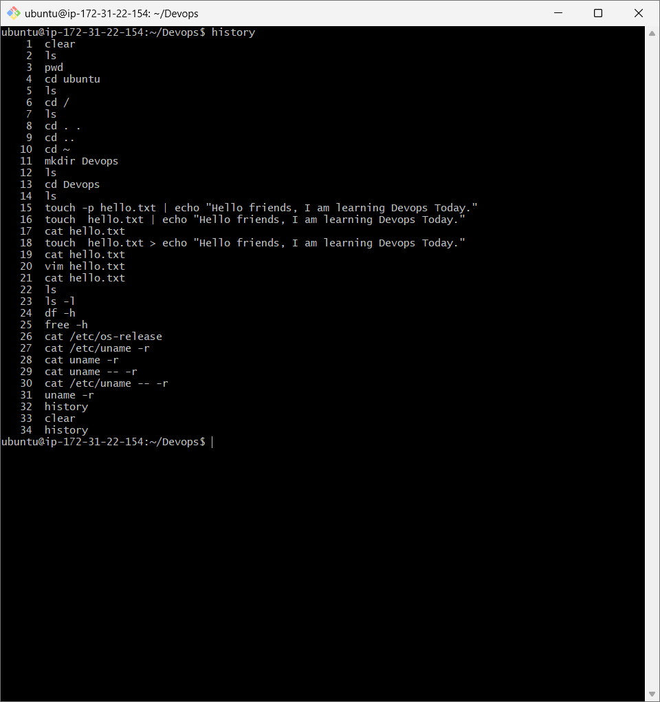
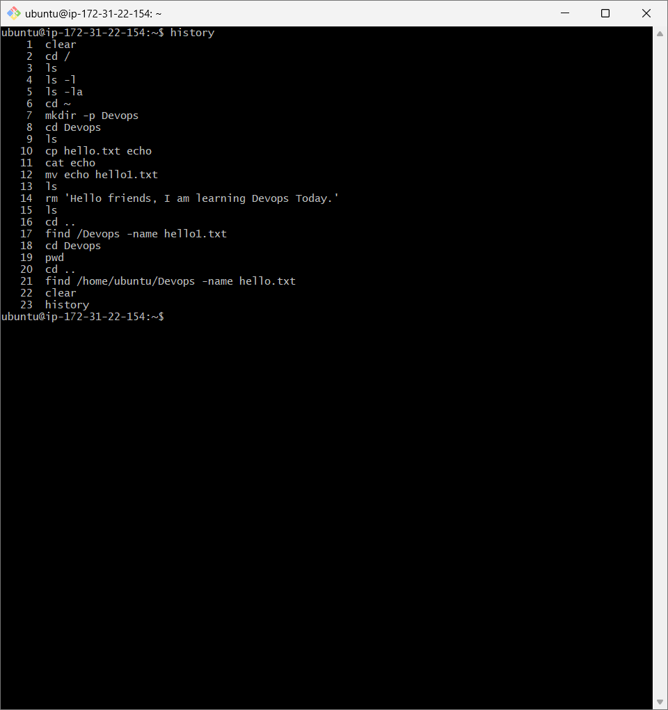
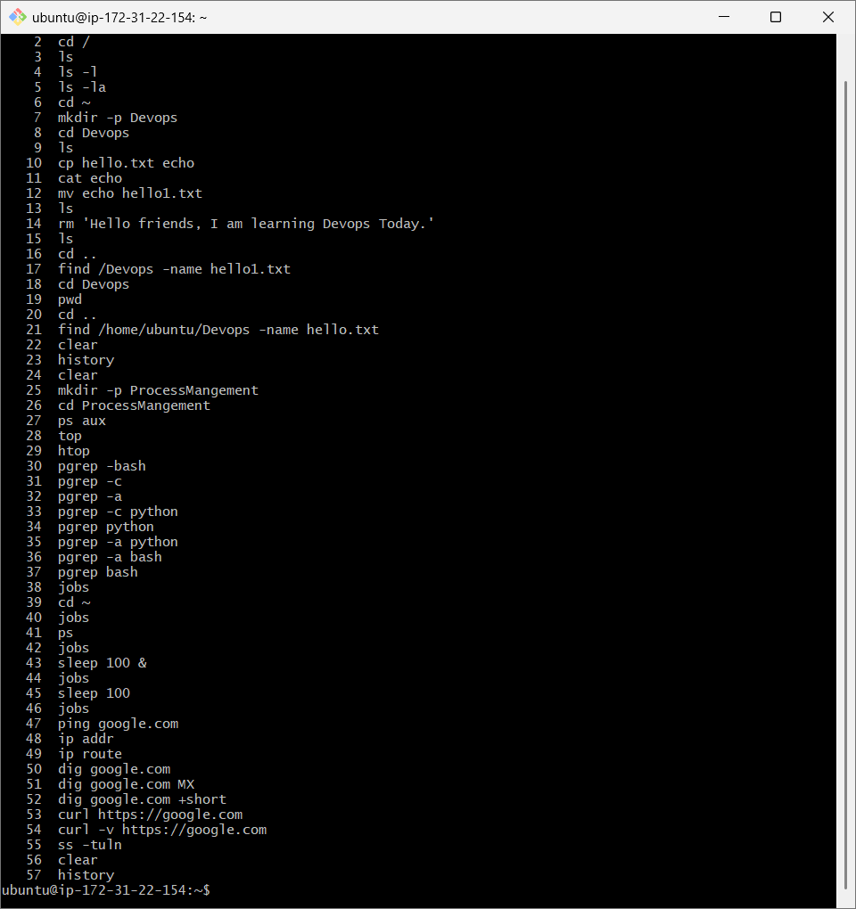
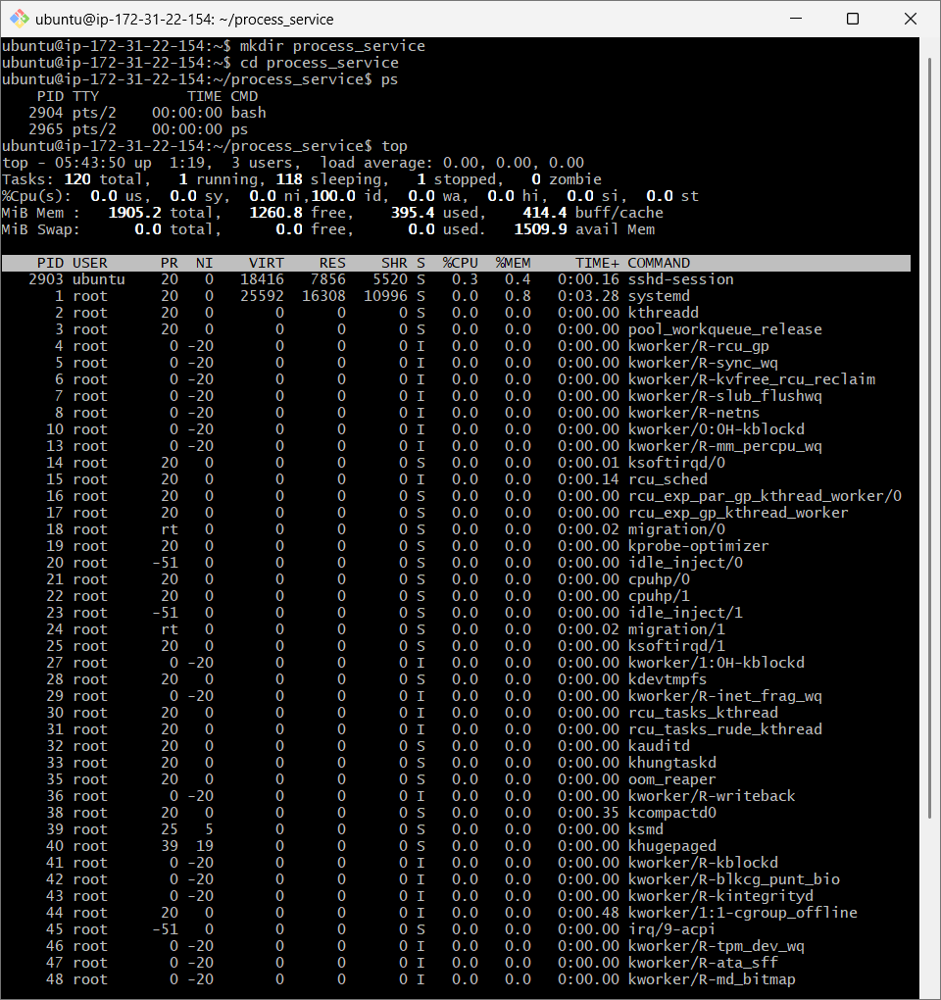
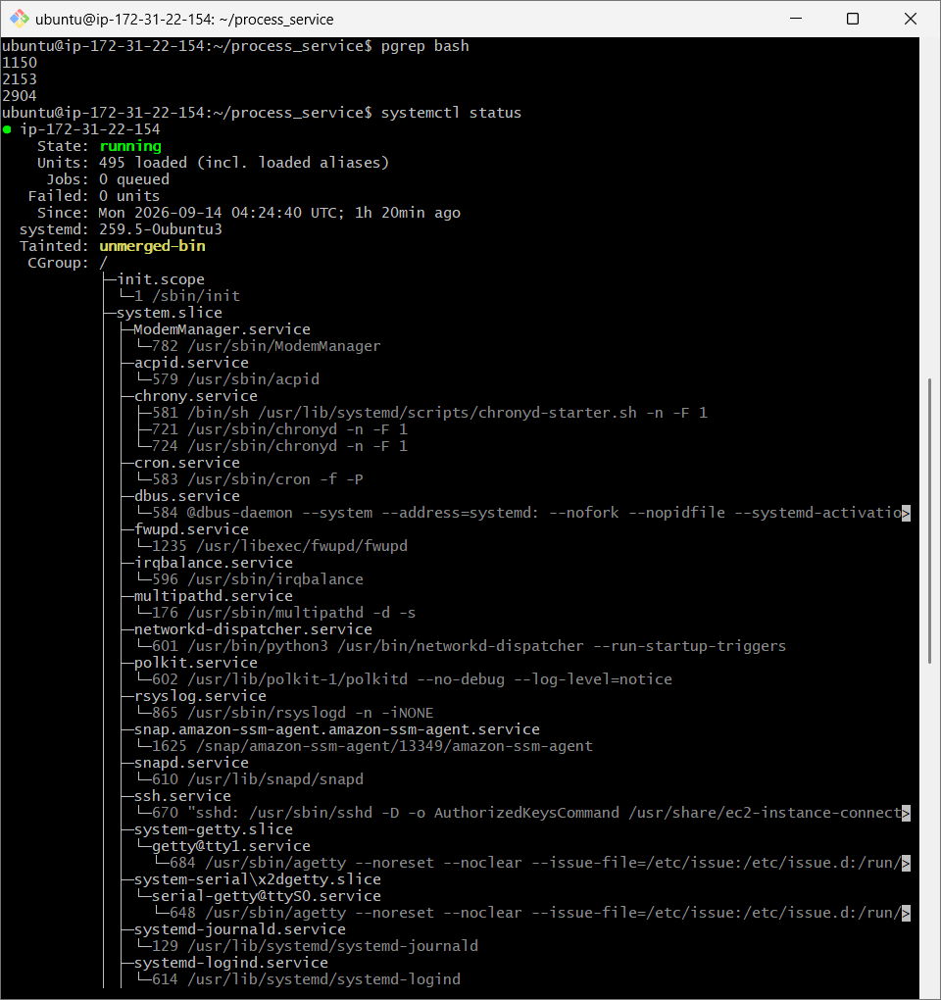
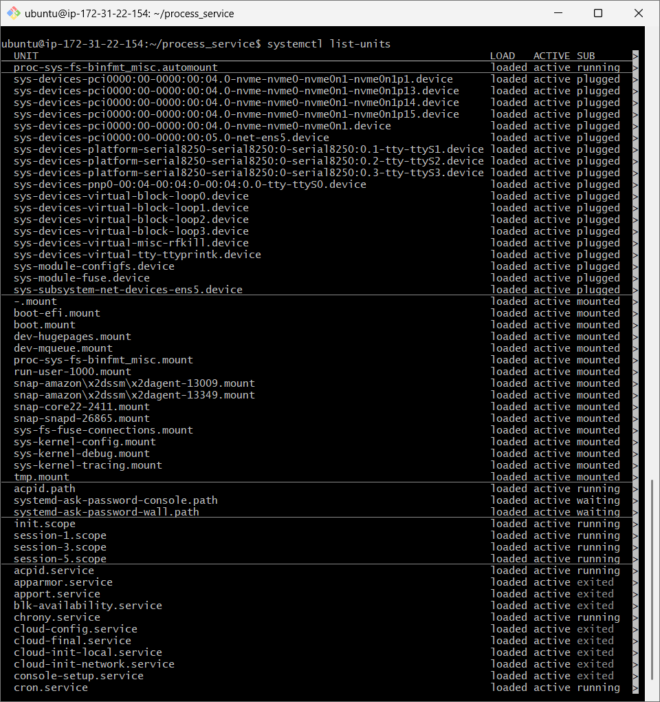
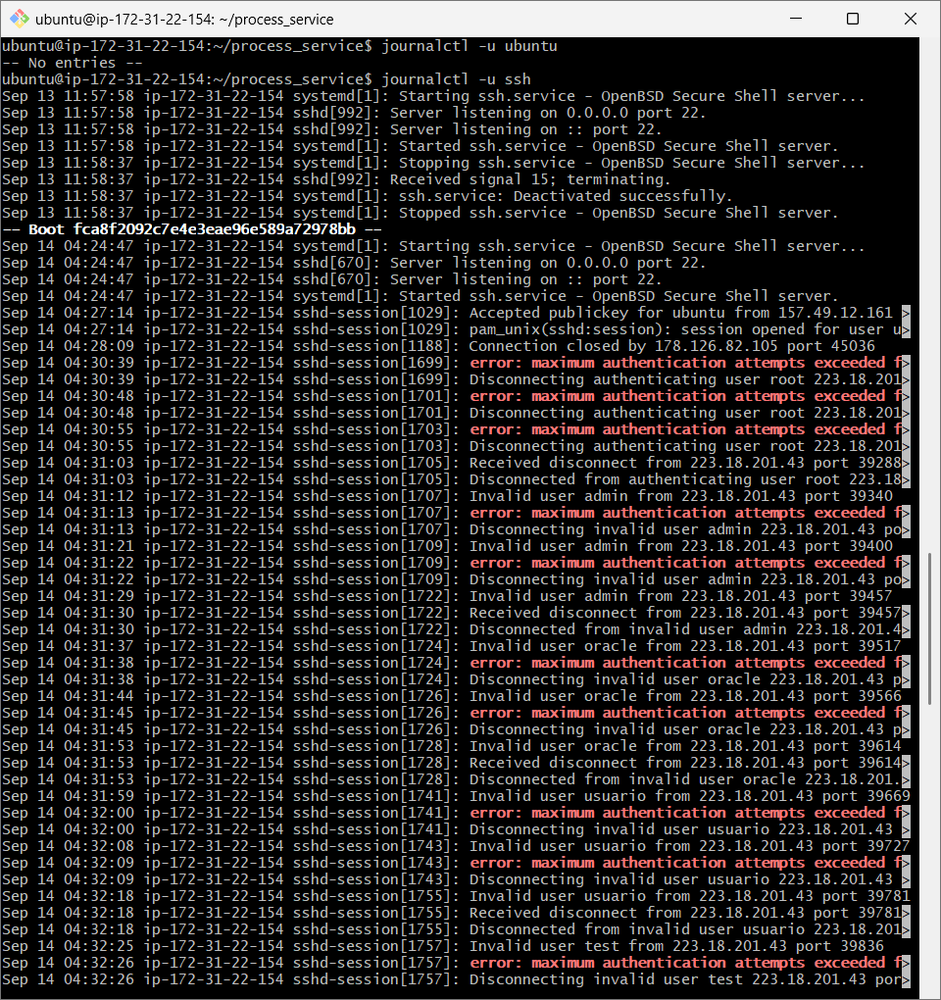
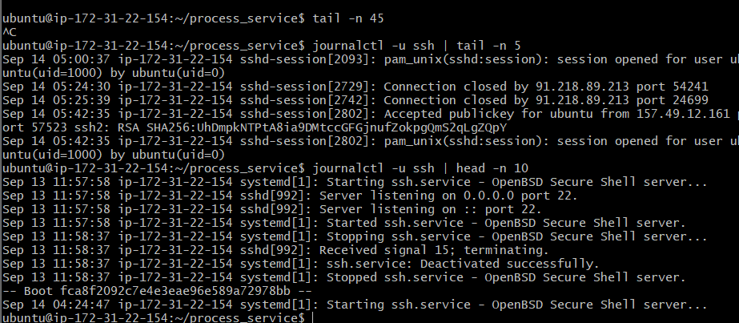
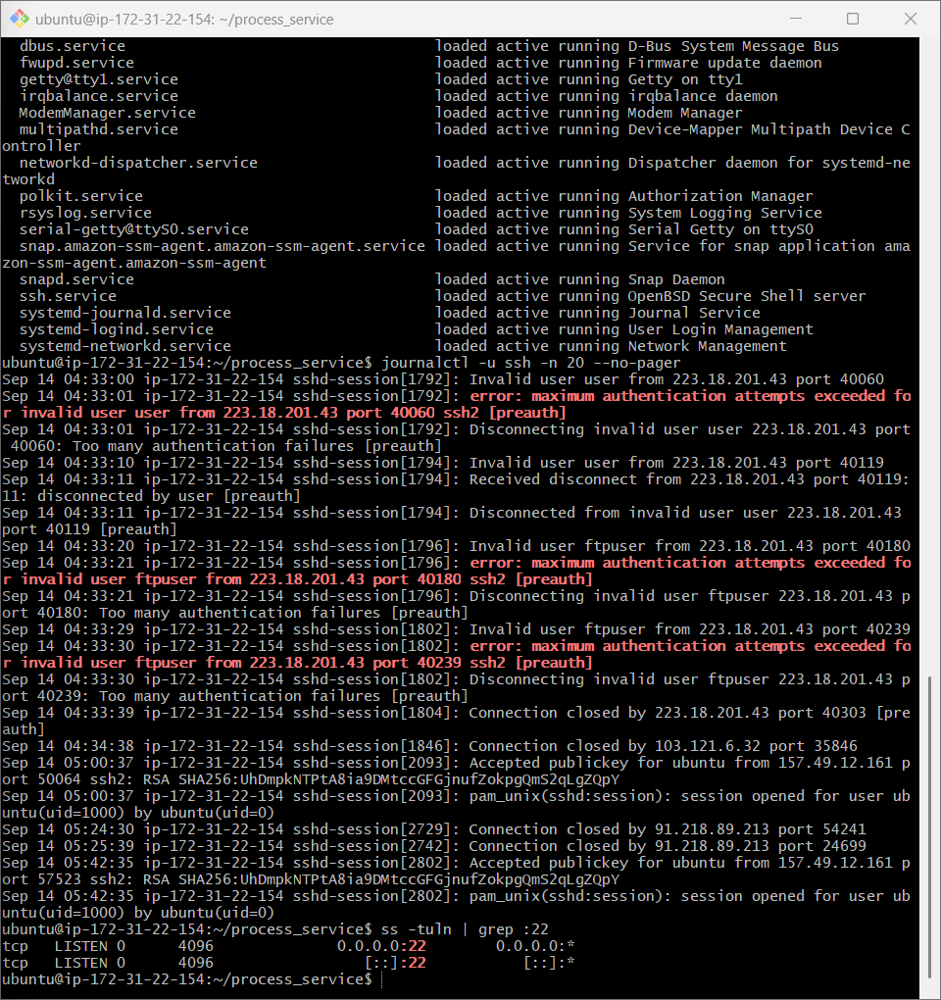
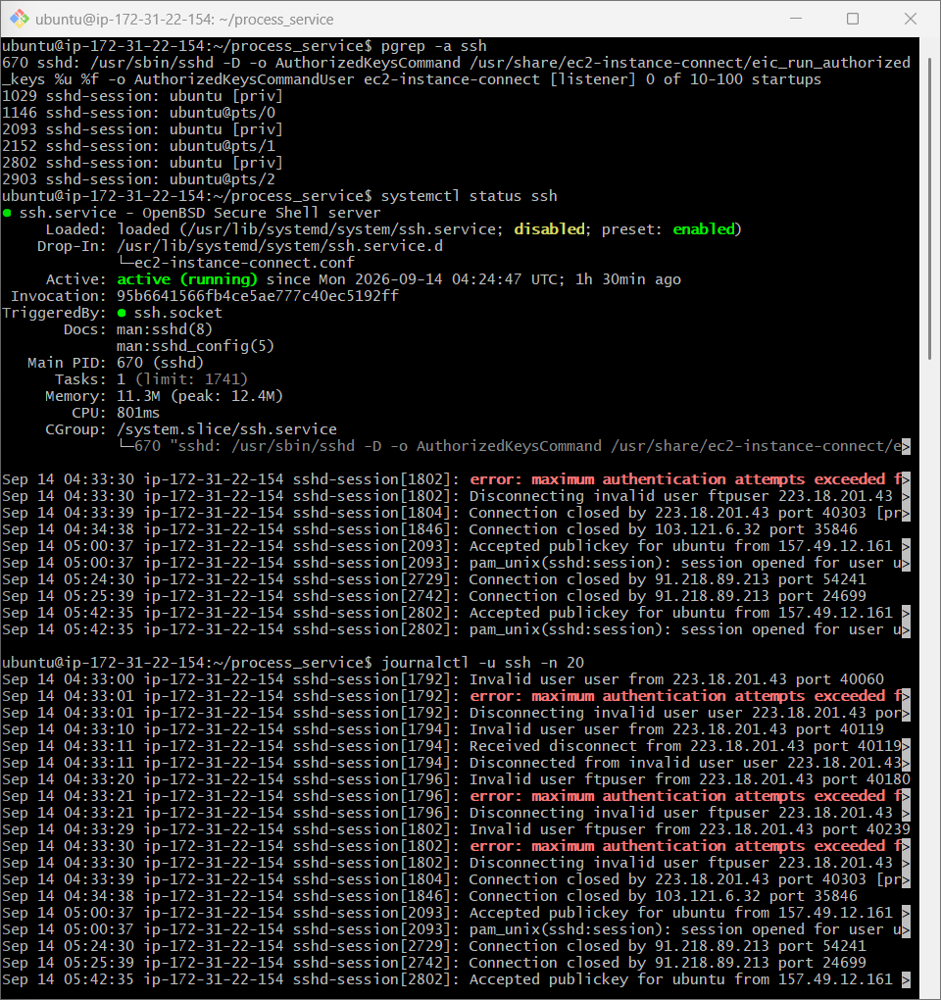

# Linux Fundamentals

# Day-02 (Linux Under the Hood)

## 1. Core Components

* **Kernel**

  * Core of Linux(heart of linux).
  * Manages CPU, RAM, storage, devices, networking, and processes.
  * Provides a bridge between applications and hardware.
  * Where linus torvalds store the code of linux.

* **User Space**

  * Where normal applications and commands run.
  * Examples: Bash, Python, `ls`, `vim`, browsers.
  * Applications interact with the kernel through **system calls(Shell Commands)**.

* **Init / systemd**

  * The first major process started by the kernel, usually **PID 1**.
  * `systemd` manages services, boot process, processes, logs, and system targets.
  * Example: starting SSH automatically when the system boots.

## 2. How Processes Work

* A **process** is a running instance of a program.
* Every process has a unique **PID (Process ID)**.
* A process can create another process called a **child process**.
* Linux commonly creates processes using:

  * `fork()` → creates a new process.
  * `exec()` → replaces the process with a new program.
* The kernel schedules processes so they can share CPU time.

## 3. What systemd Does

* Starts and stops services.
* Manages services during boot.
* Restarts failed services when configured.
* Manages dependencies between services.
* Collects system logs through **journald**.
* Useful commands:

  * `systemctl status ssh`
  * `systemctl start ssh`
  * `systemctl stop ssh`

## 4. Process States

* **Running (R)** → currently running or ready to run.
* **Sleeping (S)** → waiting for an event or resource.
* **Disk Sleep (D)** → waiting for I/O and usually cannot be interrupted immediately.
* **Stopped (T)** → execution has been paused.
* **Zombie (Z)** → process has finished, but its parent has not collected its exit status.

Check processes with:
`ps aux`

## 5. 5 Daily Linux Commands

1. `pwd` → shows current directory.
2. `ls` → lists files and directories.
3. `cd` → changes directory.
4. `ps` → views running processes.
5. `systemctl` → manages systemd services.

### Simple Flow

### How Linux Works
**Hardware → Kernel → User Space(Shell) → Applications**

### How Systemd Works
**Kernel → PID 1 (systemd) → Services → Processes**

## Screenshots 




# Day-03 (🐧 Linux Command Cheat Sheet)

## 1. 📁 File System

| Command                    | Usage                                                 |
| -------------------------- | ----------------------------------------------------- |
| `pwd`                      | Show the current directory.                           |
| `ls`                       | List files and directories.                           |
| `ls -la`                   | Show all files, including hidden files, with details. |
| `cd <dir>`                 | Move to another directory.                            |
| `mkdir <dir>`              | Create a new directory.                               |
| `touch <file>`             | Create an empty file.                                 |
| `cp <src> <dest>`          | Copy a file or directory.                             |
| `mv <src> <dest>`          | Move or rename a file/directory.                      |
| `rm <file>`                | Delete a file.                                        |
| `find <path> -name <name>` | Search for files by name.                             |

## 2. ⚙️ Process Management

| Command         | Usage                                             |
| --------------- | ------------------------------------------------- |
| `ps aux`        | Show currently running processes.                 |
| `top`           | Monitor processes and system resource usage live. |
| `htop`          | Interactive and easier-to-read process monitor.   |
| `pgrep <name>`  | Find the PID of a process by name.                |
| `kill <PID>`    | Ask a process to terminate.                       |
| `kill -9 <PID>` | Forcefully terminate a process.                   |
| `jobs`          | Show jobs running in the current shell.           |
| `bg`            | Continue a stopped job in the background.         |
| `fg`            | Bring a background job to the foreground.         |

### Important points to remember when use pgrep command
#### PID → process name:
ps -p PID -o comm=

#### Process name → PID:
pgrep process_name

#### jobs vs ps

This distinction is important:

##### Command	What it shows: 

1. jobs --	Jobs managed by your current shell
2. ps --	Processes running on the system
3. top	--Processes + resource usage live

So, jobs is mainly for managing commands you've launched from your current terminal session.

## 3. 🌐 Networking Troubleshooting

| Command        | Usage                                           |
| -------------- | ----------------------------------------------- |
| `ping <host>`  | Check whether a host is reachable.              |
| `ip addr`      | Display network interfaces and IP addresses.    |
| `ip route`     | Show the system's routing table.                |
| `dig <domain>` | Query DNS information for a domain.             |
| `curl <URL>`   | Test HTTP/HTTPS connectivity and retrieve data. |
| `ss -tuln`     | Show listening TCP/UDP ports.                   |

### Important points 

### dig <domain>
##### dig domain(dig goole.com)
             ↓
     Ask DNS for information

##### dig google.com +short
        ↓
    Just show the IP

### curl <URL>

###### curl https://example.com
###### curl -I https://example.com
###### curl -v https://example.com
1. curl -I is for a quick health check.
2. curl -v is for serious troubleshooting.


## 🔥 Quick Troubleshooting Flow

**Internet not working?**

`ip addr` → Check IP address

↓

`ip route` → Check default route

↓

`ping 8.8.8.8` → Test network connectivity

↓

`ping google.com` → Test DNS + connectivity

↓

`dig google.com` → Troubleshoot DNS

↓

`curl https://google.com` → Test HTTP/HTTPS

## 🧠 Remember

* **Files:** `ls`, `cd`, `cp`, `mv`, `rm`, `find`
* **Processes:** `ps`, `top`, `pgrep`, `kill`
* **Network:** `ip`, `ping`, `dig`, `curl`, `ss`

**Goal:** Don't memorize every Linux command. Understand **what problem each command solves**.

## Screenshots



# Day-04 (Linux Practice Note)

## ⚙️ 1. Process Commands

### 1. `ps aux`

* **What:** Displays running processes.
* **Use:** Check processes, users, CPU, memory, and PIDs.

### 2. `ps -ef`

* **What:** Shows processes in full format.
* **Use:** Check parent-child process relationships and process details.

### 3. `pgrep -a ssh`

* **What:** Finds SSH processes by name.
* **Use:** Quickly check whether SSH is running and find its PID.

### 4. `top`

* **What:** Displays processes in real time.
* **Use:** Monitor CPU, memory, and active processes.

### 5. `kill <PID>`

* **What:** Sends a signal to a process.
* **Use:** Stop a process that is no longer needed or is causing a problem.

## Screenshots


---

## 🔧 2. Service Commands

### 1. `systemctl status ssh`

* **What:** Shows SSH service status.
* **Use:** Check whether SSH is active, inactive, or failed.

### 2. `systemctl list-units --type=service --state=running`

* **What:** Lists currently running services.
* **Use:** See which services are active on the system.

### 3. `systemctl start ssh`

* **What:** Starts the SSH service.
* **Use:** Start SSH when it is stopped.

### 4. `systemctl stop ssh`

* **What:** Stops the SSH service.
* **Use:** Stop SSH when it is not needed or for maintenance.

### 5. `systemctl restart ssh`

* **What:** Stops and starts SSH again.
* **Use:** Apply configuration changes or recover a service that is behaving incorrectly.

## Screenshots 




---

## 📋 3. Log Commands

### 1. `journalctl -u ssh`

* **What:** Shows logs for the SSH service.
* **Use:** Investigate SSH activity and errors.

### 2. `journalctl -u ssh -n 20 --no-pager`

* **What:** Shows the latest 20 SSH log entries.
* **Use:** Quickly check recent SSH events.

### 3. `journalctl -u ssh --since "10 minutes ago" --no-pager`

* **What:** Shows SSH logs from the last 10 minutes.
* **Use:** Investigate a recent SSH problem.

### 4. `journalctl -p err -b`

* **What:** Shows error-level logs from the current boot.
* **Use:** Find important system errors after booting.

### 5. `tail -n 50 /var/log/syslog`

* **What:** Shows the last 50 lines of the system log.
* **Use:** Check recent system activity and errors.

> **Note:** Some distributions use `/var/log/messages` instead of `/var/log/syslog`.

## Screenshots




---

# 4. Linux Mini Troubleshooting Flow

## 🔧 Example: Troubleshooting SSH

I used the **SSH service** to practice checking processes, services, and logs.

### 1. Check SSH Process

```bash
pgrep -a ssh
```

**Why:** To find whether an SSH process is running and see its PID.

### 2. Check SSH Service

```bash
systemctl status ssh
```

**Why:** To check whether the SSH service is active, running, or failed.

### 3. Check Recent SSH Logs

```bash
journalctl -u ssh -n 20 --no-pager
```

**Why:** To see recent SSH events and identify possible errors.

### 4. Check Recent Logs Again

```bash
journalctl -u ssh --since "10 minutes ago" --no-pager
```

**Why:** To focus on recent SSH activity while troubleshooting a current problem.

### 5. Check SSH Port

```bash
ss -tuln | grep :22
```

**Why:** To check whether SSH is listening for network connections on port 22.

## Screenshots




## 🧠 Troubleshooting Flow

```text
Is SSH running?
      ↓
pgrep -a ssh
      ↓
Is the SSH service active?
      ↓
systemctl status ssh
      ↓
Are there recent errors?
      ↓
journalctl -u ssh -n 20
      ↓
Is port 22 listening?
      ↓
ss -tuln | grep :22
```

### Key Learning

**Process → Service → Logs → Network**

This gives me a simple way to troubleshoot a service instead of guessing.

## 🧠 What I Learned

**Process commands** → Tell me what is running.

**Service commands** → Tell me whether a service is active and let me manage it.

**Log commands** → Tell me what happened and help find errors.

**Troubleshooting mindset:**

> **Check → Identify → Read logs → Fix → Verify**


