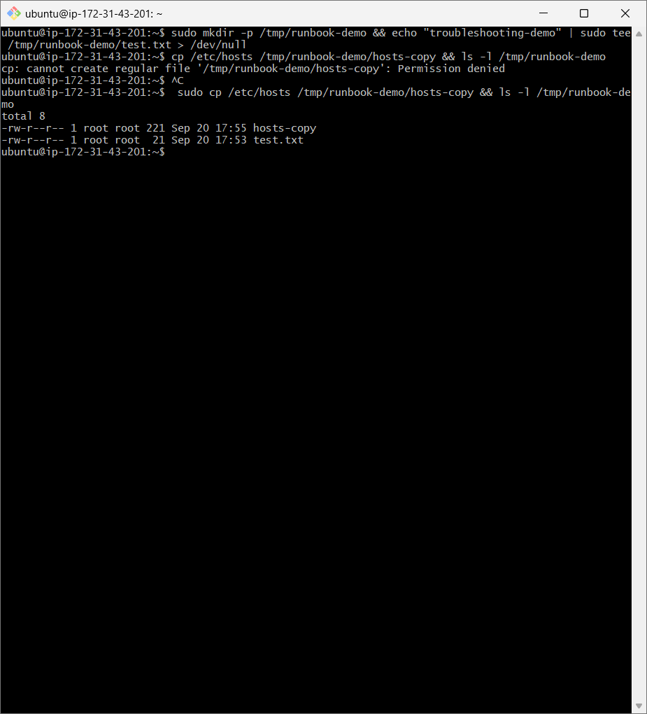
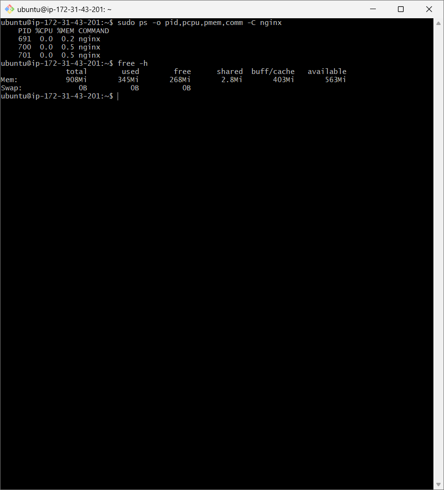
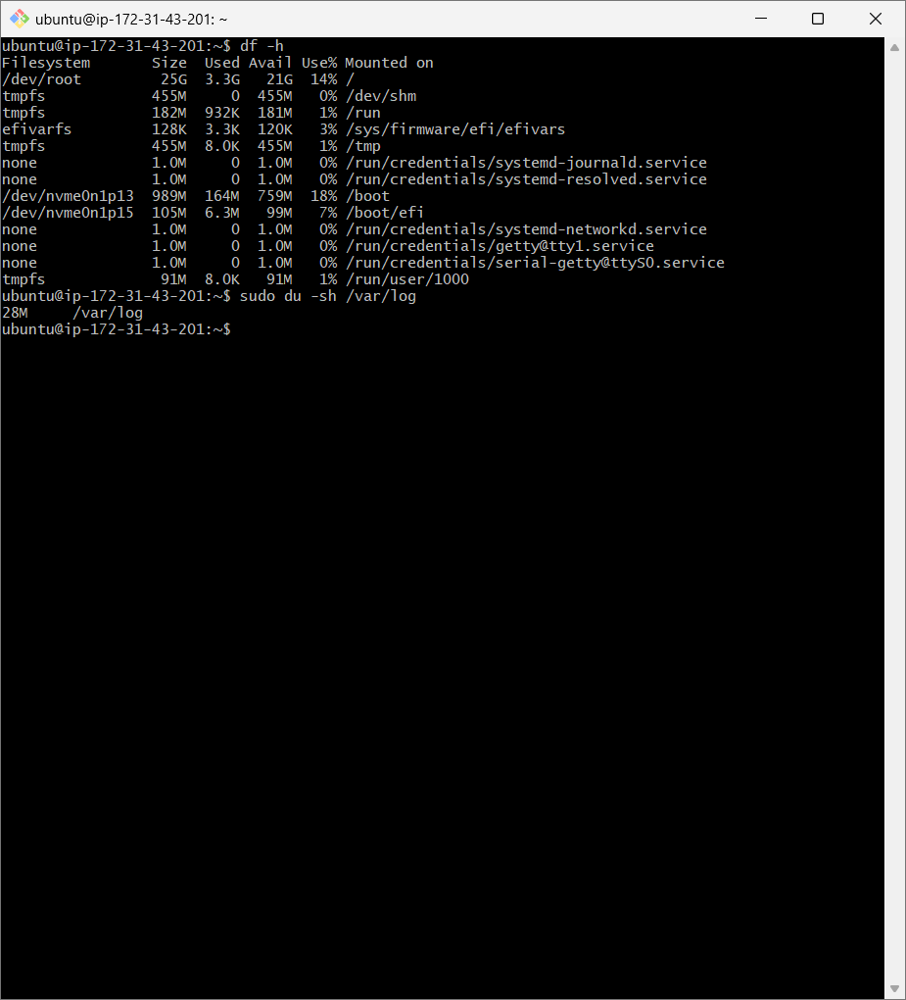
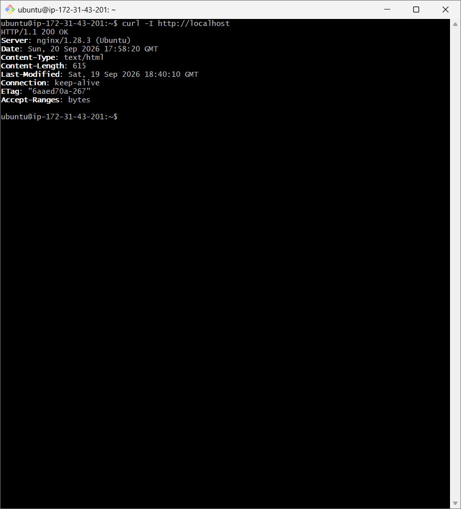
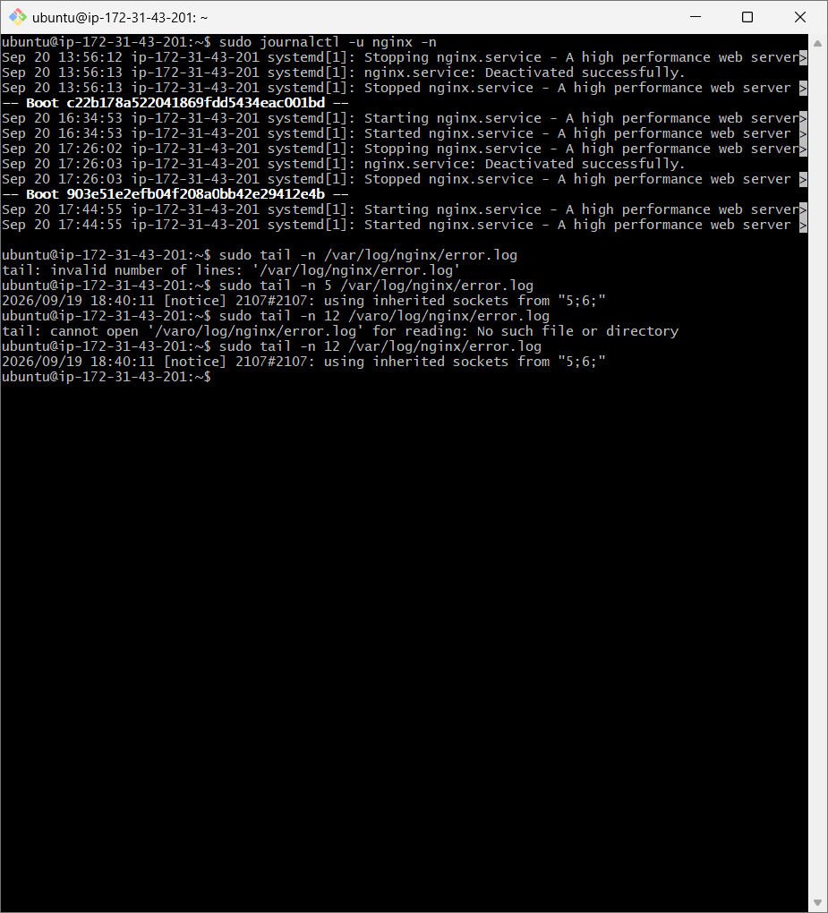
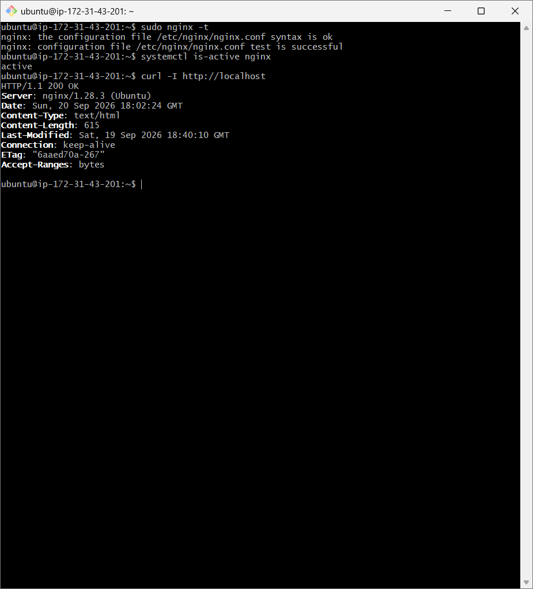

# Day 05  Linux Troubleshooting Runbook

## Target Service / Process

## Target: Nginx (nginx)

### Goal: Capture a quick health snapshot, review service/network/log evidence, and document next troubleshooting actions.

#### Screenshot convention: Save screenshots in screenshots/ using the filenames shown below.

# 1. Environment Basics

uname -a

Observation: Record the kernel version, architecture, hostname, and other environment details.

lsb_release -a / or  cat /etc/os-release

lsb_release -a
# If unavailable:
cat /etc/os-release

Observation: Record the Linux distribution and release version.

### Screenshot:

# 2. Filesystem Sanity

## Create a throwaway directory

mkdir -p /tmp/runbook-demo
echo "troubleshooting-demo" > /tmp/runbook-demo/test.txt

Observation: Confirm that the temporary directory and test file were created successfully.

## Copy and verify /etc/hosts

cp /etc/hosts /tmp/runbook-demo/hosts-copy && ls -l /tmp/runbook-demo

Observation: Confirm that the file was copied and permissions/ownership are visible.

### Screenshot:

# 3. Snapshot: CPU & Memory

## CPU / process check

ps -o pid,pcpu,pmem,comm -C nginx

Observation: Record whether Nginx is using normal or elevated CPU and memory.

## Memory

free -h

Observation: Record available memory and whether swap usage indicates memory pressure.

### Screenshot:

# 4. Snapshot: Disk & IO

## Disk capacity

df -h

Observation: Record filesystem usage. Investigate further if a filesystem is approaching capacity.

## Log directory size

sudo du -sh /var/log

Observation: Record the total log footprint and check for unexpectedly large logs.

### Screenshot:

# 5. Snapshot: Network

## Listening services

sudo ss -tulpn
Observation: Confirm that Nginx is listening on the expected HTTP/HTTPS port.

## Service endpoint

curl -I http://localhost

Observation: Record the HTTP status. 200 OK indicates that the local endpoint responded successfully.

### Screenshot:

# 6. Logs Reviewed

## Nginx systemd logs

sudo journalctl -u nginx -n 50

Observation: Check recent service events for startup failures, configuration errors, crashes, or warnings.

## Nginx error log

sudo tail -n 50 /var/log/nginx/error.log

Observation: Record whether recent errors exist and identify repeated error patterns.

### Screenshot:

# Troubleshooting flow

Health snapshot

      ↓
Service status

      ↓
CPU / Memory

      ↓
Disk / IO

      ↓
Network / Endpoint

      ↓
Service logs

      ↓
Error log

      ↓
Identify evidence → Fix → Verify

# 8. If This Worsens

## Restart strategy

Validate configuration first with sudo nginx -t.

Restart only when evidence indicates a service-level failure.

Verify with systemctl is-active nginx and curl -I http://localhost.

### Screenshot:

